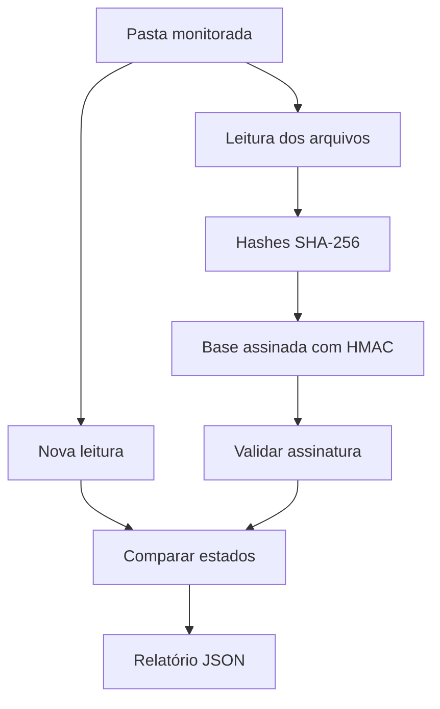

# Integrity Guard

Monitor defensivo de integridade de arquivos feito do zero em Python. Gera uma base assinada, compara o estado atual de uma pasta e informa arquivos **criados, alterados e removidos**. Funciona no Windows e Linux sem bibliotecas externas.

## O que este projeto demonstra

- Automação por linha de comando e agendamento periódico.
- Hash SHA-256 de arquivos.
- Assinatura HMAC-SHA256 da base de referência.
- Comparação determinística e relatório JSON.
- Escrita atômica para evitar arquivos parcialmente gravados.
- Tratamento seguro de links simbólicos, exclusões e erros de leitura.
- Códigos de saída próprios para scripts, CI e monitoramento.
- Testes automatizados no Windows e Linux.



## Instalação no Windows

Abra o PowerShell:

```powershell
git clone https://github.com/vastlorD/viking.git
cd viking/integrity-guard
py -3.12 -m venv .venv
.\.venv\Scripts\python.exe -m pip install -e .
```

Depois da instalação, você pode usar `integrity-guard` com o ambiente ativado ou executar `py -3.12 -m integrity_guard`, como nos exemplos abaixo.

## Demonstração em cinco minutos

Use a pasta fictícia incluída no projeto:

### 1. Criar a chave secreta

```powershell
py -3.12 -m integrity_guard keygen --key-file .integrity-key
```

A chave protege a base contra alterações silenciosas. Ela fica ignorada pelo Git.

### 2. Criar a base de referência

```powershell
py -3.12 -m integrity_guard init examples --baseline baseline.json --key-file .integrity-key
```

O programa lê `examples`, calcula os hashes e grava a base assinada.

### 3. Verificar o estado limpo

```powershell
py -3.12 -m integrity_guard check examples --baseline baseline.json --key-file .integrity-key --report report.json
```

Resultado principal:

```json
{
  "status": "clean",
  "summary": {
    "created": 0,
    "modified": 0,
    "removed": 0
  }
}
```

### 4. Simular uma alteração

```powershell
Add-Content examples/config.ini "debug = true"
New-Item examples/novo.txt -ItemType File
```

Execute a verificação novamente. O relatório mostrará `config.ini` em `modified` e `novo.txt` em `created`.

### 5. Restaurar a demonstração

```powershell
git restore examples/config.ini
Remove-Item examples/novo.txt
```

## Uso em uma pasta real

Substitua o caminho do exemplo pelo diretório que deseja monitorar:

```powershell
py -3.12 -m integrity_guard init "C:\MeuSistema\config" --baseline baseline.json --key-file .integrity-key --exclude "*.log" --exclude "cache/**"
py -3.12 -m integrity_guard check "C:\MeuSistema\config" --baseline baseline.json --key-file .integrity-key --report reports/latest.json
```

Os padrões `--exclude` podem ser repetidos. `.git`, `__pycache__` e arquivos `.pyc` são ignorados automaticamente. A base, a chave e o relatório também são excluídos quando ficam dentro da pasta monitorada.

## Resultado e códigos de saída

| Código | Significado | Uso na automação |
| --- | --- | --- |
| `0` | Nenhuma mudança | Continuar normalmente |
| `2` | Mudança detectada | Gerar alerta ou abrir investigação |
| `3` | Erro de chave, base, caminho ou leitura | Corrigir a configuração |
| `130` | Monitor interrompido com Ctrl+C | Encerramento manual |

O relatório contém horário UTC, raiz verificada, totais e listas ordenadas. Uma simples mudança na data do arquivo não gera alerta; conteúdo, tamanho ou destino de link simbólico geram.

## Modo contínuo

Verifique a cada 60 segundos até pressionar Ctrl+C:

```powershell
py -3.12 -m integrity_guard watch "C:\MeuSistema\config" --baseline baseline.json --key-file .integrity-key --report reports/latest.json --interval 60
```

Para operação longa no Windows, prefira o Agendador de Tarefas ao terminal aberto.

## Automatizar no Agendador de Tarefas do Windows

1. Abra **Agendador de Tarefas**.
2. Clique em **Criar Tarefa**.
3. Em **Geral**, use o nome `Integrity Guard`.
4. Em **Disparadores**, clique em **Novo**, escolha diariamente e marque repetição a cada 5 minutos.
5. Em **Ações**, clique em **Novo**.
6. Em **Programa/script**, informe `powershell.exe`.
7. Em **Adicionar argumentos**, informe, ajustando os dois caminhos:

```text
-NoProfile -ExecutionPolicy Bypass -File "C:\caminho\viking\integrity-guard\scripts\run-check.ps1" -Target "C:\MeuSistema\config"
```

8. Salve a tarefa e use **Executar** para testar.
9. Confira `reports/latest.json` na pasta `integrity-guard`.

O script preserva os códigos de saída. O código 2 significa alteração encontrada, não falha do programa.

## Automatizar no Linux com cron

Dê permissão ao script:

```bash
chmod +x scripts/run-check.sh
```

Abra o crontab com `crontab -e` e execute a cada cinco minutos, usando caminhos absolutos:

```cron
*/5 * * * * /caminho/viking/integrity-guard/scripts/run-check.sh /caminho/monitorado >> /caminho/integrity-guard/reports/cron.log 2>&1
```

## Quando atualizar a base

Revise primeiro o relatório. Se as mudanças forem legítimas, recrie a base:

```powershell
py -3.12 -m integrity_guard init "C:\MeuSistema\config" --baseline baseline.json --key-file .integrity-key --exclude "*.log" --force
```

Usar `--force` sem revisar destrói a referência anterior e aceita o estado atual.

## Estrutura

| Caminho | Responsabilidade |
| --- | --- |
| `integrity_guard/core.py` | Varredura, hashes, assinatura e comparação |
| `integrity_guard/storage.py` | Chave e escrita atômica de JSON |
| `integrity_guard/cli.py` | Comandos e códigos de saída |
| `scripts/` | Execução agendada em Windows e Linux |
| `tests/` | Testes unitários e de linha de comando |
| `examples/` | Pasta fictícia para demonstração |

## Limites reais

A ferramenta informa que arquivos mudaram; ela não decide se a mudança é maliciosa. Quem obtiver acesso de escrita à pasta monitorada e à chave pode substituir arquivos e gerar uma base válida. Guarde a chave e a base fora da pasta monitorada, com permissões restritas e backup. Para máquinas críticas, envie relatórios a outro sistema e controle a execução com uma conta dedicada.

A varredura lê o conteúdo completo dos arquivos. Pastas muito grandes consomem tempo e disco. Arquivos alterados durante a leitura podem produzir erro ou um retrato inconsistente; repita a checagem e investigue processos que gravam continuamente. O monitor não substitui antivírus, EDR, auditoria do sistema ou controle de acesso.

## Testes

```powershell
py -3.12 -m unittest discover -s tests -v
```

Os testes cobrem estado limpo, arquivos criados/alterados/removidos, exclusões, simples alteração de data, assinatura adulterada, chave errada, links simbólicos, arquivos atômicos e fluxo completo da CLI.

Projeto desenvolvido com assistência de IA e documentado para estudo, adaptação e apresentação técnica.
